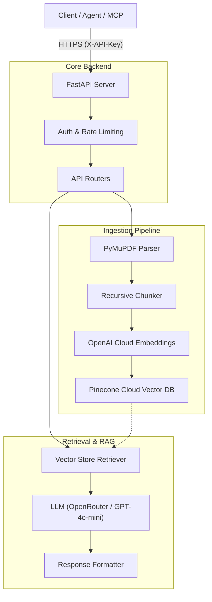

# 🧠 AI Knowledge Assistant API

A production-ready **Retrieval Augmented Generation (RAG)** API designed for high-performance document intelligence. Build, query, and extract insights from your documents with full source attribution. 

> [!NOTE]
> Designed with production stability in mind, addressing common pitfalls highlighted in *"Most RAG Systems Fail in Production"* (e.g., robust chunking, metadata filtering, and cross-platform reliability).

---

## 🏗️ Architecture



---

## ✨ Key Features

- **Document Ingestion**: Upload PDF, TXT, or Markdown files. Support for automatic chunking and indexing.
- **RAG-Powered Q&A**: Answers grounded in your documents with precise source attribution and confidence scoring.
- **AI-Driven Insights**:
    - **Summarization**: Structured summaries with key concepts and bullet points.
    - **Key Interest Points**: Extraction of major insights, important terms, and action items.
- **Developer First**:
    - **Swagger UI**: Interactive documentation at `/docs`.
    - **MCP Manifest**: Native support for Model Context Protocol.
    - **Production Ready**: Built-in rate limiting, security middleware, and structured logging.

---

## 🚀 Quick Start

### 1. Requirements
- Python 3.9+
- [OpenRouter API Key](https://openrouter.ai/keys) (for LLM)

### 2. Setup
```bash
# Clone the repository
git clone https://github.com/your-repo/AIKnowledgeAssistantAPI.git
cd AIKnowledgeAssistantAPI

# Create and activate virtual environment
python -m venv .venv
source .venv/bin/activate  # On Windows: .venv\Scripts\activate

# Install dependencies
pip install -r requirements.txt

# Configure environment
cp .env.example .env
# Edit .env and set your OPENROUTER_API_KEY, OPENAI_API_KEY (optional), and API_KEY
```

### 3. Run Locally
```bash
uvicorn app.main:app --reload --port 8000
```
Visit **http://localhost:8000/docs** to explore the interactive API documentation.

### 🛡️ Production Readiness & Stability
- **Cross-Platform Compatibility**: Automatically handles environment-specific challenges (e.g., dynamically adjusting `TIKTOKEN_CACHE_DIR` for Vercel vs. Windows/Linux).
- **Pinecone Integration**: Uses Pinecone's serverless/pod-based architecture for scalable vector storage and fast retrieval.
- **Enterprise Settings**: Configurable `CHUNK_SIZE`, `CHUNK_OVERLAP`, and rate limits to prevent API abuse and optimize retrieval performance.

---

## 🔌 API Summary

| Method | Endpoint | Description |
|---|---|---|
| `POST` | `/upload-doc` | Upload and index a document (PDF, TXT, MD). |
| `POST` | `/ask-question` | Retrieval-augmented Q&A from indexed content. |
| `POST` | `/summarize` | Generate structured summaries. |
| `POST` | `/extract-keypoints` | Extract insights, terms, and action items. |
| `GET` | `/health` | Check system status. |

---

## 🛡️ Security & Authentication

All protected endpoints require the **`X-API-Key`** header. This key is your internal secret defined in the `.env` file as `API_KEY`.

```bash
curl -X POST http://localhost:8000/ask-question \
  -H "X-API-Key: your-secret-key" \
  -H "Content-Type: application/json" \
  -d '{"question": "How does RAG work?"}'
```

---

## �️ Tech Stack

- **API Framework**: [FastAPI](https://fastapi.tiangolo.com/)
- **Orchestration**: [LangChain](https://www.langchain.com/)
- **Vector Database**: [Pinecone](https://www.pinecone.io/)
- **Embeddings**: [OpenAI Embeddings](https://platform.openai.com/docs/guides/embeddings) (`text-embedding-3-small`)
- **LLM Provider**: [OpenRouter](https://openrouter.ai/)
- **Deployment**: [Vercel](https://vercel.com/)
- **Observability**: [LangSmith](https://smith.langchain.com/)
